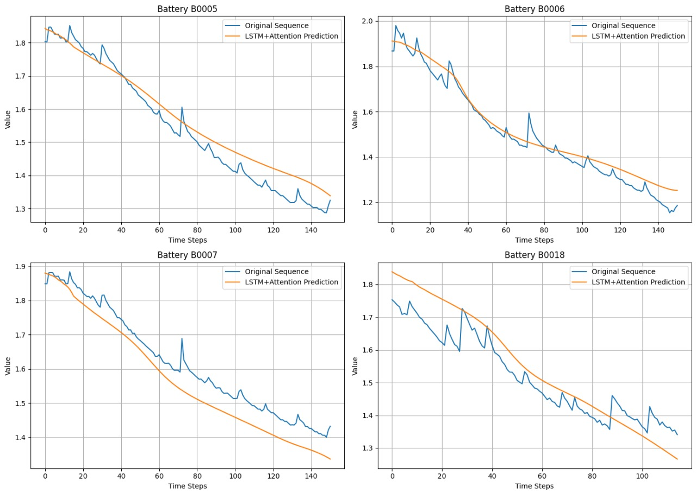
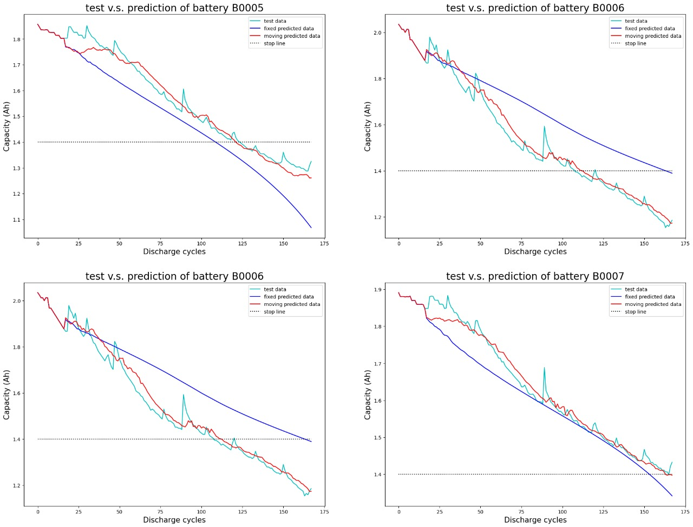

# Battery Life Prediction Project

This project implements various deep learning models (MambaNet, AutoReformer, DLinear, XLSTM) for battery life prediction.

## Team Members
- Mehul Jain (Team Lead) - 522206
- Krishna Tayal - 522152
- Shivam Kumar - 522242
- Satya Pavan - 522146
- Jayavarapu Varshitha - 522137

## Project Explanation
Watch our project explanation:
[![Link]](https://youtu.be/syUTNftDMbQ?si=WCCgt6VHo51anUHa)

## Setup Instructions

### 1. Download Models and Dataset

First, download the required .pth models and dataset using the provided bash script:

```bash
cd data
chmod +x download_dataset.sh
./download_dataset.sh
```

This will create a `downloaded_files` directory containing:
- Model weights (.pth files)
  - Mamba.pth
  - AutoReformer.pth
  - Adv_Dlinear.pth
  - XLSTM.pth
- Dataset files

### 2. Install Requirements

Install all required dependencies using pip:

```bash
cd Code
pip install -r requirements.txt
```

Make sure you have CUDA installed if you want to use GPU acceleration.

### 3. Run the Project

Execute the main script:

```bash
cd Code
python main.py
```
The script will:
1. Load the pre-trained models
2. Generate predictions using each model
3. Create an ensemble prediction using LSTM with attention
4. Display comparative plots for different batteries


### 4. Results and Outputs
All generated plots and model outputs are saved in the `assets` folder:
```
├── assets/
│   └── results/         # Performance metrics visualizations
```

## Project Structure

```
├── Code/
│   ├── main.py           # Main implementation
│   ├── requirements.txt  # Dependencies
│   ├── Mamba.ipynb    # MambaNet training implementation
│   ├── AutoReformer.ipynb # AutoReformer training implementation
│   ├── Dlinear.ipynb  # DLinear training implementation
│   └── XLSTM.ipynb    # XLSTM training implementation
├── data/
│   ├── download_dataset.sh  # Dataset/model downloader
│   └── downloaded_files/    # Downloaded models and data
├── assets/               # Output graphs and comparision with Model from research paper Transformer network for remaining useful life prediction of lithium-ion batteries(2022) and visualizations and Presentation
```

#### Model Performance Comparison

*Figure 1: Comparison of prediction accuracy across different batteries*


*Figure 2: Comparison with recent Research Model predicitions*

## System Requirements

- Python 3.8+
- CUDA toolkit (optional, for GPU support)
- 8GB RAM minimum
- 2GB disk spaces